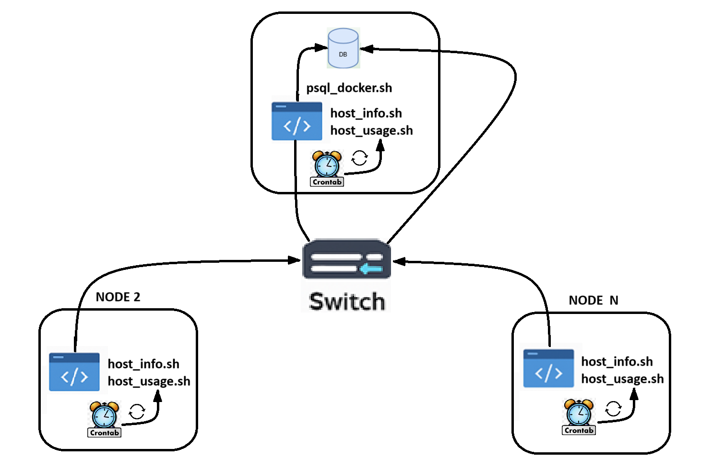

# Linux Cluster Monitoring Agent

---
## Introduction

---
I developed the **Linux Cluster Monitoring Agent** as a Minimum Viable Product (MVP) to support the Linux Cluster Administration (LCA) team at Jarvis in managing and monitoring our Linux clusters more efficiently.
The LCA team needed a way to track both hardware specifications and real-time resource usage across all cluster nodes.

This project addresses those needs by:
- Setting up a PostgreSQL database inside a Docker container to collect and store hardware details and resource utilization metrics.
- Building a bash script agent that automatically gathers server resource data at regular intervals and logs it into the PostgreSQL database.
- Using Git for version control to track changes and maintain project integrity.

## Quick Start

---
### 1. Launch the PostgreSQL Database with `psql_docker.sh`

---
1.1 To create a new Docker container with this command (if it doesn't already exist)
```bash
bash -x ./linux_sql/scripts/psql_docker.sh create postgres password
```

1.2 Start the psql instance inside the Docker container with the command:
```bash
bash -x ./linux_sql/scripts/psql_docker.sh start
```

1.3 Stop the psql instance inside the Docker container with the Command:
```bash
bash -x ./linux_sql/scripts/psql_docker.sh stop
```

### 2. Create `host_agent` Database Using `ddl.sql` Script

---
2.1 Create 'host_agent' database with `ddl.sql` containing `host_info` and `host_usage` table:
```bash
psql -h localhost -U postgres -d host_agent -f linux_sql/sql/ddl.sql
```

### 3. Insert Hardware Specifications Data into the `host_agent` Database Using `host_info.sh` Script

---
3.1 Command to execute the host_info.sh shell script:
```bash
bash -x ./linux_sql/scripts/host_info.sh localhost 5432 host_agent postgres password
```

### 4. Insert Hardware Usage Data into the `host_agent` Database Using `host_usage.sh` Script

---
4.1 Command to execute the `host_usage.sh` shell script:
```bash
bash -x ./linux_sql/scripts/host_usage.sh localhost 5432 host_usage postgres password
```

### 5. Crontab Setup

---
5.1 Obtain the complete path of the host_usage.sh script:
```bash
pwd
```

5.2 Edit the crontab jobs on your Linux system:
```bash
crontab -e
```

5.3 Insert the following command to execute the `host_usage.sh` file every minute:
```bash
* * * * * bash /home/rocky/dev/jarvis_data_eng_AdityaShukla/linux_sql/host_agent/scripts/host_usage.sh localhost 5432 host_agent postgres password > /tmp/host_usage.log
```

## Implementation

---
I built the **Linux Cluster Monitoring Agent** using bash scripting alongside a **PostgreSQL** database running inside a Docker container:
- The `psql_docker.sh` script handles **Docker Container** management for the database.
- I attached a **Docker Volume** to the container to make sure data persists even if the container stops or is removed.
- The `ddl.sql` script sets up two tables: host_info for hardware specifications and `host_usage` for real-time performance metrics.
- `host_info.sh` captures and inserts hardware details, while `host_usage.sh` gathers live server resource stats.
- I configured crontab to run `host_usage.sh` every minute to ensure resource usage data is continuously logged.

## Architecture

---
The architecture of this project can be seen in the image below:
> _Linux Cluster Monitoring Agent Architecture_


## Scripts

---
### `psql_docker.sh`
- Allows users to **Create**, **Start**, or **Stop** a Docker instance for connecting to a PSQL database.
- Expects **three** command line arguments:
    - 1: `[Create | Start | Stop]` - Action to perform.
    - 2: `PostgreSQL_Username`
    - 3: `PostgreSQL_Password`

### `host_info.sh`

- Collects system hardware specifications and stores them in the `host_info` table.
- Expects **five** command line arguments:
    - 1: Hostname
    - 2: Port number
    - 3: PSQL database name
    - 4: PSQL username
    - 5: PSQL password
- **Run once**, as hardware specifications are static.

### `host_usage.sh`
- Collects **current system memory usage** information and stores it inside the `host_usage` table.
- Expects **the same five arguments** as `host_info.sh`.
- Expected to be **executed every minute** via crontab.

### `ddl.sql`
- Connects to the `host_agent` database.
- Creates the `host_info` and `host_usage` tables if they don't already exist.
- Displays the current tables in the database.

### `queries.sql`
- Connects to the `host_agent` database.
- Analyzes:
    - Average memory usage every 5 minutes.
    - Host failures based on crontab entries in a 5-minute interval.

### Crontab
- I used cronta to **automatically execute** the `host_usage.sh` script every minute.
- The (`* * * * *`) syntax ensures execution **every minute**.

## Database Modeling

---
### Schema of `host_info` table
| Column Name       | Data Type | Constraint              | Description                      |
|-------------------|-----------|-------------------------|----------------------------------|
| id                | SERIAL    | Primary Key             | ID assigned to the host machine  |
| hostname          | VARCHAR   | Unique; NOT NULL        | Name of the Host machine         |
| cpu_number        | INT2      | NOT NULL                | Number of CPUs                   |
| cpu_architecture  | VARCHAR   | NOT NULL                | CPU Architecture type            |
| cpu_model         | VARCHAR   | NOT NULL                | CPU Model Information            |
| cpu_mhz           | FLOAT8    | NOT NULL                | Clock speed in MHz               |
| l2_cache          | INT4      | NOT NULL                | Size of Level 2 CPU Cache        |
| timestamp         | TIMESTAMP |                         | Time data was obtained           |
| total_mem         | INT4      |                         | Total memory available           |

### Schema of `host_usage` table
| Column Name       | Data Type | Constraint                      | Description                                   |
|-------------------|-----------|---------------------------------|-----------------------------------------------|
| timestamp         | TIMESTAMP | NOT NULL                        | Time data was obtained                        |
| host_id           | SERIAL    | Foreign Key; References `id`    | Host ID from `host_info`                      |
| memory_free       | INT4      | NOT NULL                        | Unused memory (MB)                            |
| cpu_idle          | INT2      | NOT NULL                        | CPU idle percentage                           |
| cpu_kernel        | INT2      | NOT NULL                        | CPU time spent in Kernel (%)                  |
| disk_io           | INT4      | NOT NULL                        | Number of disk I/O operations                 |
| disk_available    | INT4      | NOT NULL                        | Available disk space (MB)                     |

## Test

---
- `psql_docker.sh` tested with:
    - Valid inputs (create, start, stop).
    - Invalid parameters and incorrect arguments to ensure error handling.
- `ddl.sql` tested:
    - Ensuring tables are only created if they don't exist.
    - Sample inserts and deletions validated.
- **Crontab efficiency** tested by:
    - Checking if new rows are inserted every minute into the `host_usage` table.

## Deployment

---
This project has been deployed using:

- **GitHub**: Source code management.
- **Docker**: Running PostgreSQL database as a container.
- **Crontab**: Automating `host_usage.sh` script execution every minute.

## Improvements

---
- Periodically clean up `host_usage` logs to reduce storage.
- Perform **weekly analysis** of system health and notify users of anomalies.
- Analyze which nodes are the busiest in terms of **memory usage** using SQL scripts.