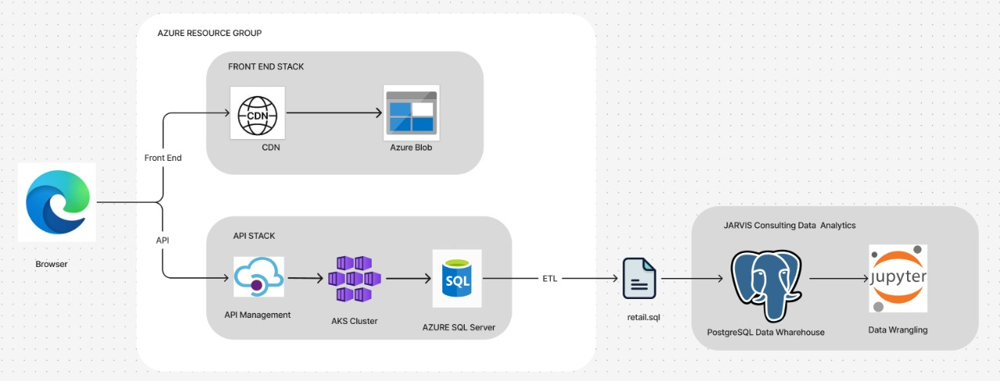

# Retail Data Analytics for LGS

## Introduction

**London Gift Shop (LGS)** is a UK-based retail business looking to unlock value from its historical sales data. The goal of this analytics project is to explore customer behaviour, identify patterns in transactions, and provide actionable insights that support smarter decision-making across marketing, operations, and customer engagement.

Using tools like Python, PostgreSQL, and Jupyter Notebook, we built an analytics pipeline to ingest, clean, and analyze the raw transactional data. From basic KPIs to advanced customer segmentation (RFM), this project delivers a comprehensive proof of concept (PoC) for data-driven strategy at LGS.

---

## Technologies Used

- **Python 3.8** - for data analysis and wrangling
- **Jupyter Notebook** - interactive data exploration
- **Pandas, NumPy, Matplotlib** - data processing and visualization
- **PostgreSQL (Dockerized)** - OLAP-like data warehouse setup
- **SQL** - for schema inspection and metric validation
- **Docker** - containerized dev environments
- **Git & GitHub** - version control and collaboration

---

## Implementation

### Project Architecture

LGS is an online retail website that uses Azure SQL Server as the backend in its API infrastructure to manage and store real-time retail data. For the purpose of this project, the LGS team exported a historical SQL dump of their retail transactions. As part of the ETL (Extract, Transform, Load) process, any personally identifiable customer information was excluded to maintain privacy. To carry out the analysis, the data was loaded into a PostgreSQL database running inside a Docker container. Additionally, a separate Docker container was set up with Jupyter Notebook to facilitate the data wrangling and analysis workflows.

---

## Data Analytics & Wrangling

Notebook: [`./retail_data_analytics_wrangling.ipynb`](./retail_data_analytics_wrangling.ipynb)

### Key Analysis Performed

#### Data Cleaning
- Removed null/missing `customer_id`
- Filtered invalid or negative transactions
- Converted datetime formats and created derived fields

#### Sales Metrics
- Monthly revenue trends and growth rate
- Revenue per invoice and per customer
- Country-level revenue performance

#### Customer Behavior
- New vs. existing customers by month
- Active customers per time period

#### RFM Segmentation
Used Recency, Frequency, and Monetary metrics to classify customer segments:
- **Recency**: How recently a customer purchased
- **Frequency**: How often they purchased
- **Monetary**: Total spend over time

These insights help LGS:
- Run targeted campaigns for high-value segments
- Re-engage dormant customers
- Investigate high cancellation periods
- Plan stocking strategies based on monthly trends

---

## Sample Visuals (from the notebook)

- Monthly Revenue Trends
- Customer Acquisition Curve (New vs. Existing)
- RFM Heatmaps & Scoring Distributions
- Country-wise Revenue Distribution

---

## Improvements & Next Steps

With more time, this project could be extended with:

1. **BI Dashboard** - Interactive dashboards using Streamlit, Power BI, or Tableau

2. **Automated Pipeline Capability** - To enhance scalability and reduce manual intervention, the entire analytics workflow from data ingestion to RFM segmentation can be automated using modern orchestration tools: Cron Jobs (for lightweight scheduling)

---

## Conclusion

This project lays the foundation for LGS to evolve from basic descriptive analytics toward predictive and prescriptive capabilities. With strategic investments in data pipelines and real-time dashboards, LGS can transform its raw data into a long-term competitive advantage.
